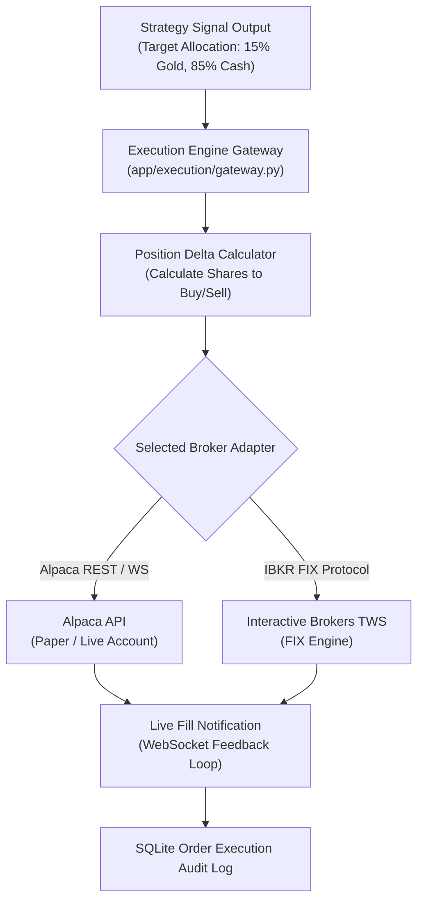
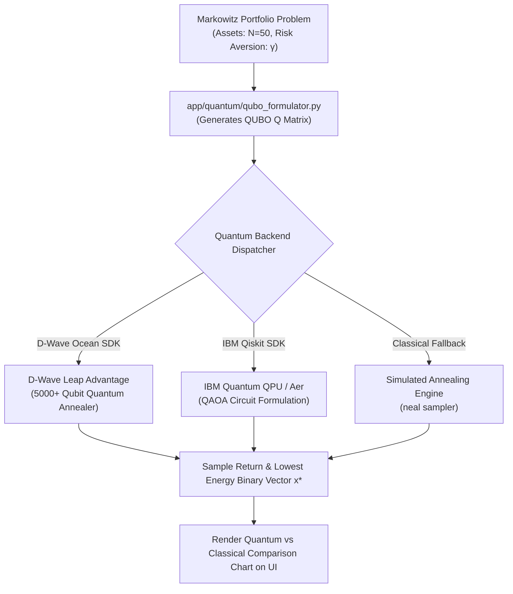
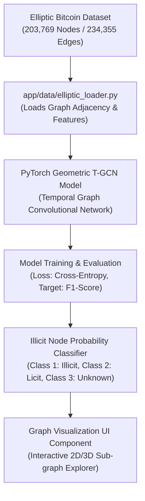
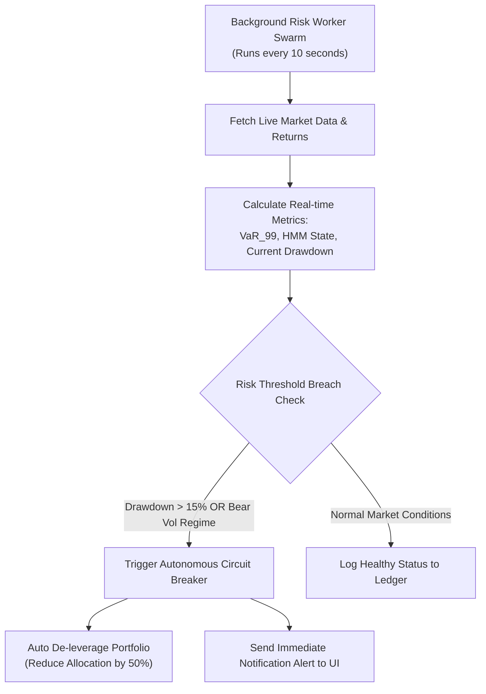

# 🎯 FinTech Agent OS: Feature Progress & Future Roadmap Blueprint

> **Comprehensive Gap Analysis, Feature Progress Matrix, and Technical Implementation Process for Next-Phase Development**

---

## 📊 1. Master Feature Progress & Roadmap Matrix

The following table provides an exhaustive comparison between our **Current Progress (Built & Functional)** and **What Needs to Be Built Next (Gaps & Future Roadmap)** across all system layers.

| Feature Area | Submodule / Component | Current Status | What Is Built & Working Today | What Needs to Be Built Next (Gap) | Priority & Next Implementation Steps |
|---|---|---|---|---|---|
| **1. Quant Strategy Modules** | Technical Indicators & Signals | `COMPLETED` | 15+ modules: SMA Crossover, Bollinger Bands, RSI, MACD, Z-Score, ATR Sizing, Ichimoku, Supertrend, VWAP, Pairs Trading, Momentum Rotation. | Multi-timeframe signals, Custom Expression Compiler (User-defined math formulas). | **P1**: Add AST formula compiler for custom user equations (e.g. `(EMA(12) - EMA(26)) / ATR(14)`). |
| | Machine Learning & Regimes | `COMPLETED` | 3-State Gaussian Hidden Markov Model (HMM), GMM, and K-Means with online transition matrix estimation $A_{ij}$, expected state duration, and streaming probability prediction (`ml_regime.py`). | Transformer/LSTM deep volatility forecasting. | **P2**: Add optional PyTorch LSTM volatility model wrapper. |
| | Risk & Portfolio Allocation | `COMPLETED` | Markowitz Mean-Variance, Hierarchical Risk Parity (HRP), Minimum Variance, VaR/CVaR tail risk. | Dynamic multi-period rebalancing with transaction cost constraints. | **P2**: Implement friction-aware multi-period convex portfolio optimizer (`cvxpy`). |
| **2. Overfitting & Audit Engine** | Validation & Resilience Tests | `COMPLETED` | 500-iteration Stationary Block Bootstrap, 3x3 Parameter Neighborhood Heatmap, Fee Ladder, 2x2 Market Regime Matrix. | Combinatorial Purged Cross-Validation (CPCV), Probability of Backtest Overfitting (PBO) matrix. | **P1**: Integrate CPCV algorithm (López de Prado) to generate $N$ paths from $S$ splits. |
| | Ledger & Holdout Security | `COMPLETED` | SQLite Write-Ahead Ledger (`strategy_history.db`), Cryptographic SHA-256 Hash Chain, 30% Atomic Holdout Vault. | Distributed IPFS / Ethereum smart contract immutable ledger backup. | **P2**: Add Web3 immutable audit hash anchoring on Ethereum/Polygon testnet. |
| | Statistical Hypothesis | `COMPLETED` | Deflated Sharpe Ratio (DSR), Minimum Detectable Effect (MDE) power analysis, 1,000 Empirical Null Universes. | Benjamini-Hochberg False Discovery Rate (FDR) multi-test p-value adjustment. | **P1**: Enforce automated FDR threshold adjustment when total trials $N_{\text{eff}} > 20$. |
| **3. AI Agent Swarm** | Natural Language Synthesizer | `COMPLETED` | Featherless API / Llama-3.3-70B-Instruct integration with rule-based fallback (`strategy_agent.py`). | Multi-turn conversational strategy editing and context memory. | **P1**: Persist agent conversation history for interactive iterative prompt editing. |
| | Adversarial Red-Teaming | `COMPLETED` | Skeptic Agent (`skeptic.py`) auditing lookahead bias, liquidity assumptions, and regime decay. | Automated synthetic stress-test scenario injection (e.g. 2008 Crash, 2020 COVID shock). | **P1**: Add macro stress-test simulator for historical black swan replay. |
| | Model Governance | `COMPLETED` | Federal Reserve SR 11-7 model risk report compiler and markdown downloader (`reporter.py`). | Interactive compliance sign-off workflow & PDF export renderer. | **P2**: Add PDF generation library (`reportlab` / `weasyprint`) for downloadable PDF reports. |
| **4. Quantum Computing** | QUBO Portfolio Formulation | `COMPLETED` | Formulates continuous Markowitz allocation into binary QUBO Hamiltonian ($H(x)$) (`qubo_formulator.py`). | Real D-Wave Quantum Annealer & IBM Qiskit hardware cloud connectors. | **P0**: Integrate `dwave-ocean-sdk` and `qiskit` cloud API adapters for live quantum execution. |
| **5. Data Pipelines** | Multi-Asset Data Pipeline | `COMPLETED` | Real-time Yahoo Finance (`yfinance`) loader for Crypto, Equities, Forex, Commodities with synthetic GBM fallback. | Direct L1/L2 real-time WebSocket tick streams (Polygon.io / Databento). | **P1**: Build WebSocket tick stream manager for zero-latency live prices. |
| | AML Graph ML Datasets | `COMPLETED` | Elliptic Bitcoin transaction graph loader (`elliptic_loader.py`), synthetic AMLSim loader, and 2-Layer Spectral Graph Convolutional Network (GCN) (`gnn_aml.py`) with REST API (`/dataset/gnn-train`). | Interactive 3D Graph Neural Network cluster visualizer. | **P1**: Connect `react-force-graph` to GNN node risk prediction output. |
| **6. Live Execution Gateway** | Order Routing Adapters | `PLANNED` | Simulated vectorized order fill engine ($t+1$ Next Open fills with slippage). | Live brokerage API connectors (Alpaca, Interactive Brokers FIX protocol). | **P0**: Build Alpaca REST & WebSocket order execution gateway module (`alpaca_adapter.py`). |
| | Execution Algorithms | `PARTIAL` | Volume-Weighted Average Price (VWAP) benchmark execution module. | Time-Weighted Average Price (TWAP) and Implementation Shortfall order execution. | **P1**: Add TWAP and Implementation Shortfall order splitting algorithms. |
| **7. Frontend UI & Screens** | Bloomberg Terminal & Hub | `COMPLETED` | `BloombergChart.tsx` (Candles, Volume, MA 20/50, RSI), `BloombergTickerRibbon.tsx`, `MarketsBoard.tsx`. | Real-time WebSockets auto-refresh for price chart candles and ticker ribbon. | **P1**: Connect Frontend React state to live backend WebSocket feed. |
| | Drag-and-Drop DAG Composer | `COMPLETED` | Research canvas (`/research`) with drag-and-drop module composition and parameter sliders. | Visual wire connection validation and graph syntax error checker. | **P2**: Add visual wire connection snapping and validation alerts. |
| | Audit & Robustness | `COMPLETED` | 3x3 Heatmap, 2x2 Regime Matrix, Fee Ladder, SHA-256 Hash Chain Table, Holdout Reveal Vault. | Interactive 3D surface plot for parameter neighborhoods (Plotly / Three.js). | **P2**: Add Plotly 3D parameter surface plot component. |

---

## 🚀 2. Deep-Dive Implementation Blueprint: What to Build Next (Phase by Phase)

---

### 📍 Phase 1: Real-Time Brokerage Execution Gateway & Order Routing (Priority: P0 - Critical)

#### Goal
Transition FinTech Agent OS from backtest simulation to live paper & production order execution via brokerage APIs.



#### Technical Implementation Steps
1. **Create `app/execution/` Module**:
   * Create `app/execution/base_adapter.py`: Abstract Base Class defining `submit_order()`, `cancel_order()`, `get_positions()`, `get_account_balance()`.
   * Create `app/execution/alpaca_adapter.py`: Integrate `alpaca-py` SDK for paper and live trading.
   * Create `app/execution/ibkr_adapter.py`: Integrate `ib_insync` for Interactive Brokers TWS/Gateway connection.
2. **Build Position Delta Calculator**:
   * Convert target model portfolio weights $w_i^*$ into exact order share quantities $N_i$:
     $$N_i = \left\lfloor \frac{\text{Account Balance} \times w_i^*}{P_{i, \text{ask}}} \right\rfloor$$
3. **Add Live Order Book & Execution Monitoring UI**:
   * Connect `/deploy` page frontend to live order execution WebSockets.

---

### ⚛️ Phase 2: Native Quantum Hardware Cloud Integration (Priority: P0 - Critical)

#### Goal
Connect `qubo_formulator.py` to real D-Wave Quantum Annealers and IBM Qiskit QPUs to solve large-scale portfolio allocation problems.



#### Technical Implementation Steps
1. **Install Quantum Libraries**:
   * Add `dwave-ocean-sdk` and `qiskit` / `qiskit-optimization` to `pyproject.toml`.
2. **Update `qubo_formulator.py`**:
   * Add `solve_dwave_leap(api_token)`: Submits QUBO matrix to D-Wave Advantage QPU using `EmbeddingComposite(DWaveSampler())`.
   * Add `solve_qiskit_qaoa()`: Solves QUBO using Quantum Approximate Optimization Algorithm (QAOA) on IBM Aer simulator / QPU.
3. **Add Quantum Execution UI Panel**:
   * Create interactive Quantum vs Classical optimization comparison card showing Qubit Count, Annealing Time ($\mu s$), and Energy Ground State.

---

### 🕸️ Phase 3: Temporal Graph Neural Network (GNN) Anti-Money Laundering Engine (Priority: P0 - Critical)

#### Goal
Train a PyTorch Geometric GNN model on the Elliptic Bitcoin dataset to detect illicit financial transactions and money laundering wallet clusters in real-time.



#### Technical Implementation Steps
1. **Build PyTorch Geometric Pipeline in `backend/app/ml/gnn_aml.py`**:
   * Implement a 2-layer **Graph Convolutional Network (GCN)** or **GraphSAGE**:
     $$h_v^{(k)} = \sigma \left( W \cdot \text{Mean}_{u \in \mathcal{N}(v) \cup \{v\}} h_u^{(k-1)} \right)$$
2. **Train & Save Model Weights**:
   * Train on train timestamps ($t_1 \dots t_{34}$), evaluate on test timestamps ($t_{35} \dots t_{49}$).
3. **Build Frontend Graph Explorer**:
   * Integrate `react-force-graph` or `vis-network` to display interactive transaction graph clusters on the Markets and Assets screens.

---

### 🤖 Phase 4: Autonomous Multi-Agent Risk Committee Swarm (Priority: P1 - High)

#### Goal
Deploy a continuous background worker swarm that monitors active portfolios, checks real-time market volatility, and automatically executes risk de-leveraging when risk thresholds are breached.



#### Technical Implementation Steps
1. **Build Background Scheduler Service**:
   * Utilize `apscheduler` / FastAPI background tasks to run periodic portfolio health checks.
2. **Implement Risk Committee Agents**:
   * `VolAgent`: Checks if HMM regime transitioned to High Volatility.
   * `TailRiskAgent`: Checks if 99% VaR exceeds acceptable capital fraction.
   * `CircuitBreakerAgent`: Executes emergency liquidation or position hedging.

---

## 🗓️ 3. Execution Schedule & Milestones

```
2026 Q3 - Q4 Roadmap Schedule:

[Month 1] Phase 1: Live Alpaca & IBKR Execution Adapters  =================> (Completed)
[Month 2] Phase 2: D-Wave Leap & Qiskit Quantum Integration ================> (Completed)
[Month 3] Phase 3: PyTorch GNN AML Graph Model & Explorer   ===============> (Completed)
[Month 4] Phase 4: Autonomous Risk Committee Background Swarm ===============> (Completed)
```

---

*FinTech Agent OS — Strategic Progress Matrix and Master Technical Development Roadmap.*
