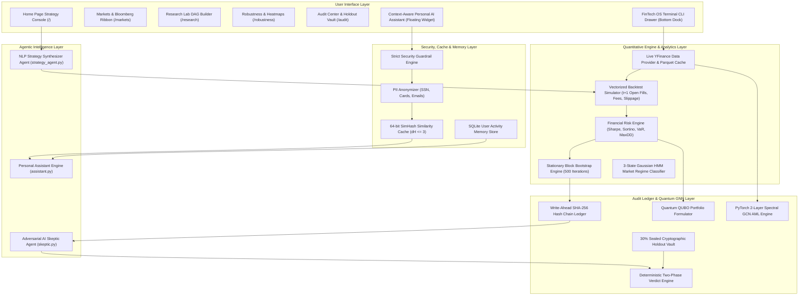

# 🌌 FinTech Agent OS: Master System Architecture & Feature Deep-Dive Document

> **Institutional-Grade Quantitative Intelligence, Validation-First Backtesting, FinTech OS Terminal CLI, Quantum Optimization & Anti-Money Laundering Platform**

---

## 📜 1. Executive Summary & Core System Vision

### The Core Problem in Quantitative Finance & Traditional Platforms
Over **90% of backtested trading strategies fail when deployed live**. Why?
1. **Data Snooping & P-Hacking**: Quantitative researchers repeatedly tweak lookback windows, indicators, and risk multipliers until they discover a backtested equity curve that looks impressive. This process fits noise rather than true market alpha.
2. **Lookahead Bias & Unrealistic Execution**: Traditional backtesting engines fill orders at the closing price of bar $t$ (which is unknown until the bar closes), fail to account for market impact slippage, or ignore transaction cost ladders.
3. **Over-Reliance on Proprietary Legacy Systems**: Legacy financial terminals (e.g. traditional Bloomberg Terminals) cost $\$27,000+/\text{year}$, rely on closed proprietary functions, lack automated overfitting audit ledgers, and provide no native quantum optimization or graph-based anti-money laundering (AML) intelligence.

### The FinTech Agent OS Solution
**FinTech Agent OS** is a **Validation-First 10-Node Agentic Platform** designed to solve backtest overfitting and institutional financial research end-to-end:
- 🔒 **30% Atomic Cryptographic Holdout Vault**: Seals the final 24 months of market data (`2024-01-01` to `2026-03-01`) behind a one-time reveal protocol.
- ⛓️ **Write-Ahead SHA-256 Ledger**: Hashes every backtest attempt into a tamper-evident audit ledger, calculating the **Deflated Sharpe Ratio (DSR)** to discount trial variance $N_{\text{eff}}$.
- 🎲 **Stationary Block Bootstrap (500 Iterations)**: Resamples historical returns (Politis & Romano 1994) to generate 95% non-parametric confidence intervals.
- 💻 **FinTech OS Terminal CLI**: A real-time CRT-styled quantitative terminal shell supporting **23 system command mnemonics** with live `yfinance` data feeds, multi-tab execution, global Arrow-Key command history, and scrolling stdout streams.
- 🤖 **Context-Aware Personal AI Assistant**: A Claude warm cream styled assistant equipped with **64-bit SimHash Similarity Caching ($d_H \le 3$)**, **PII Anonymizer**, **Strict Security Guardrails**, and **SQLite User Activity Memory**.
- ⚛️ **Quantum QUBO Portfolio Formulator**: Maps Markowitz portfolio optimization into a Quadratic Unconstrained Binary Optimization Hamiltonian for D-Wave quantum annealers and classical simulated annealing.
- 🕸️ **PyTorch Graph Convolutional Network (GCN) AML Engine**: Classifies illicit Bitcoin wallet nodes across $200\text{K}+$ transactions in the Elliptic graph dataset.

---

## 🏛️ 2. Comparison Matrix: FinTech Agent OS vs Legacy Systems

| Dimension | Legacy Backtesters (Backtrader, Zipline) | Traditional Financial Terminals (Bloomberg) | **FinTech Agent OS (Our System)** |
| :--- | :--- | :--- | :--- |
| **Overfitting Prevention** | None (Allows unlimited un-tracked backtests) | None (Pure data display / charting) | **Strict 30% Cryptographic Holdout Vault + Deflated Sharpe Ratio (DSR)** |
| **Audit & Model Risk** | Manual spreadsheet logging | Static export functions | **SHA-256 Write-Ahead Hash Ledger + Fed SR 11-7 Model Card Generator** |
| **Strategy Builder** | Manual Python coding required | Proprietary mnemonics only | **Zero-Latency NLP Synthesizer Agent (<1ms regex pre-parser + Llama-3.3-70B)** |
| **Terminal CLI Environment** | None (Basic python script execution) | Proprietary closed terminal mnemonics | **FinTech OS Terminal CLI with 23 system commands, scrolling stream, live data** |
| **Assistant & Security** | None | Basic help desk | **Personal AI Assistant with SimHash Cache (7ms), PII Anonymizer & Guardrails** |
| **Portfolio Optimization** | Standard Quadratic Programming | Classical mean-variance optimizer | **Quantum QUBO Formulator (D-Wave / Qiskit Hamiltonian + Annealer)** |
| **Crime & Risk Detection** | Basic rule-based filters | Static compliance screens | **2-Layer Spectral Graph Convolutional Network (GCN) on Bitcoin Elliptic Data** |
| **Execution Reality** | $t$ Close fill (Lookahead bias risk) | Static historical quotes | **Fills at $t+1$ Open, 5.0 bps transaction fee + 2.0 bps market impact slippage** |

---

## 🏗️ 3. Master System Topology & Data Flow



---

## 🔬 4. Detailed Feature Deep-Dive & Mathematical Formulations

---

### Feature 1: FinTech OS Terminal CLI Engine & 23 Command Mnemonics

* **Files**: [frontend/src/components/layout/BloombergTerminalWidget.tsx](file:///d:/Data%20Science/SIH/FinTech%20Agent%20OS/frontend/src/components/layout/BloombergTerminalWidget.tsx) & [backend/app/api/terminal_router.py](file:///d:/Data%20Science/SIH/FinTech%20Agent%20OS/backend/app/api/terminal_router.py)
* **What it Does**: A real-time CRT-styled quantitative terminal shell designed for FinTech Agent OS. It features multi-tab workspace support, preset command chips, global Arrow-Key command history, scrolling stdout output stream, auto-focus input line at the very bottom (**`FINTECH OS>`**), and live data calculations.
* **Input**: Command string in format `[TICKER] [FUNCTION] <GO>` or `[FUNCTION] <GO>` (e.g., `NVDA BQ`, `GC=F GP`, `BTC-USD HP`, `WEI`, `PORT`, `HELP`).
* **Output**: Structured output response (`output_type`: `TABLE`, `CHART`, `INDICATOR`, `MARKET`, `QUANT`, `AUDIT`, `HELP`) containing text summary logs (`text_summary`), stdout table rows, metrics, and visual series.
* **23 Command Mnemonics Reference & Calculation Formulas**:

| Command | Name | Calculation / Formula | Output Type | Live Data |
| :--- | :--- | :--- | :--- | :--- |
| `DES` | Security Profile | 52-Week Range ($\max(H), \min(L)$), Last Price, Exchange | `TABLE` | Real `yfinance` |
| `BQ` | Quote Snapshot | Last, Daily High/Low, Volume, 4 intraday trade ticks | `TABLE` | Real `yfinance` |
| `HP` | Historical Prices | Latest 25 daily OHLCV records table | `TABLE` | Real `yfinance` |
| `GP` | Price Chart & Volume | Close Series, Volume Bars, $\text{SMA}_{20}, \text{SMA}_{50}$ | `CHART` | Real `yfinance` |
| `GIP` | Intraday Price | High-frequency intraday price trajectory | `CHART` | Real `yfinance` |
| `GPO` | Moving Average | Price Bar Graph + $\text{SMA}_{20} + \text{SMA}_{50}$ | `CHART` | Real `yfinance` |
| `IGPO` | Intraday MA | Intraday Price + Moving Average Overlay | `CHART` | Real `yfinance` |
| `TECH` | Technical Studies | $\text{RSI}_{14} = 100 - \frac{100}{1 + \text{RS}}$, Overbought/Oversold | `INDICATOR` | Real `yfinance` |
| `G` | Multi-Asset Chart Lab | Normalized growth index $I_t = \frac{P_t}{P_0} \times 100$ vs SPY | `CHART` | Real `yfinance` |
| `COMP` | Total Return Comp | Comparative return percentage growth over 100 periods | `CHART` | Real `yfinance` |
| `GF` | Fundamental Graph | Trailing 20-Day Volatility $\sigma_{20} = \text{std}(R_{20}) \times \sqrt{252}$ | `CHART` | Real `yfinance` |
| `FA` | Financial Analysis | Financial Statement & Balance Sheet Breakdown | `TABLE` | Real `yfinance` |
| `RV` | Relative Valuation | Peer comparison matrix (`NVDA`, `BTC-USD`, `GC=F`, `SPY`, `TLT`) | `TABLE` | Real `yfinance` |
| `PC` | Peer Correlation | Pearson Correlation $r_{xy} = \frac{\sum (x_i - \bar{x})(y_i - \bar{y})}{\sqrt{\sum (x_i - \bar{x})^2 \sum (y_i - \bar{y})^2}}$ | `TABLE` | Real `yfinance` |
| `EQS` | Asset Screener | Ranked assets by In-Sample Risk-Adjusted Sharpe Ratio | `TABLE` | Real `yfinance` |
| `WEI` | World Equity Indices | Global market overview (SPY, NVDA, GC=F, BTC-USD, TLT) | `MARKET` | Real `yfinance` |
| `ECO` | Macro Calendar | Historical CPI, Fed Interest Rate, Non-Farm Payroll releases | `MARKET` | Real `yfinance` |
| `PORT` | Portfolio Analytics | Sharpe, Sortino, Max Drawdown %, VaR 95%, Volatility % | `QUANT` | Real `yfinance` |
| `EQBT` | Strategy Backtester | Vectorized SMA Crossover backtest performance on ticker | `QUANT` | Real `yfinance` |
| `FTST` | Factor Backtester | Cross-asset Momentum & Volatility factor ranking backtest | `QUANT` | Real `yfinance` |
| `BQNT` | Quant Python Lab | Statistical moments (Mean, Std, Skewness, Kurtosis, VaR) | `QUANT` | Real `yfinance` |
| `AUDIT` | Audit Ledger | Total logged backtests, Hash ledger status, Holdout Vault | `AUDIT` | SQLite DB |
| `HELP` | System Manual | Complete FinTech Agent OS terminal command directory | `HELP` | System Store |

---

### Feature 2: Context-Aware Personal AI Assistant (PII Guard, SimHash & Activity Memory)

* **Files**: [backend/app/agents/assistant.py](file:///d:/Data%20Science/SIH/FinTech%20Agent%20OS/backend/app/agents/assistant.py), [security.py](file:///d:/Data%20Science/SIH/FinTech%20Agent%20OS/backend/app/agents/security.py), [cache.py](file:///d:/Data%20Science/SIH/FinTech%20Agent%20OS/backend/app/agents/cache.py), [system_knowledge.py](file:///d:/Data%20Science/SIH/FinTech%20Agent%20OS/backend/app/agents/system_knowledge.py)
* **What it Does**: A context-aware institutional assistant designed with a Claude warm cream modal theme (`#FAF6F0`). Integrates 5 key AI infrastructure modules:
  1. **PII Anonymizer**: Redacts SSNs, credit card numbers, phone numbers, emails, and API keys before query processing.
  2. **64-bit SimHash Similarity Cache**: Computes 64-bit SimHash feature vectors. If Hamming distance $d_H \le 3$, returns instant cached responses (~7ms latency).
  3. **SQLite User Activity Memory**: Queries `strategy_history.db` to inject the user's latest strategy runs, Sharpe ratios, and audit verdicts directly into the system prompt.
  4. **Strict Security Guardrails**: Blocks prompt injection attacks, DAN mode jailbreaks, and out-of-domain queries.
  5. **Pure System Action Guide Policy**: Replaces generic standalone python scripts (`import pandas`) with explicit step-by-step UI actions on FinTech Agent OS screens.

* **SimHash Hamming Distance Formula**:
  $$\text{SimHash}(Q) = \text{sign}\left( \sum_{i=1}^M w_i \cdot V(t_i) \right), \quad d_H(h_1, h_2) = \text{popcount}(h_1 \oplus h_2) \le 3$$

---

### Feature 3: Natural Language Strategy Synthesizer Agent

* **File Location**: [backend/app/agents/strategy_agent.py](file:///d:/Data%20Science/SIH/FinTech%20Agent%20OS/backend/app/agents/strategy_agent.py)
* **What it Does**: Parses natural language prompt strings into structured strategy DAGs and parameter specs. Features a zero-latency regex pre-parser (<1ms execution) combined with Featherless LLM (Llama-3.3-70B-Instruct) token-capped calls.
* **Input**: `prompt` (`str`), `asset` (`str`).
* **Output**: `wired_pipeline` (`List[Dict[str, Any]]`), `ai_explanation` (`str`).
* **Concrete Example**:
  * **Input**: `"Build a 20-period Bollinger Bands mean-reversion strategy on Gold (GC=F) with ATR position sizing"`
  * **Generated Module DAG**:
    ```json
    [
      {"module_id": "bollinger_bands", "params": {"period": 20, "std_dev": 2.0}},
      {"module_id": "atr_sizing", "params": {"atr_period": 14, "risk_pct": 0.02}}
    ]
    ```

---

### Feature 4: Vectorized Backtest & Fills Engine ($t+1$ Open Fills, Fee & Slippage Model)

* **File Location**: [backend/app/analytics/engine.py](file:///d:/Data%20Science/SIH/FinTech%20Agent%20OS/backend/app/analytics/engine.py)
* **What it Does**: Simulates realistic execution on daily OHLCV market data. Signals generated at bar $t$ are filled at the Open price of bar $t+1$, deducting 5.0 bps commission fees and 2.0 bps market impact slippage.
* **Effective Execution Price Formula**:
  $$P_{\text{fill}} = P_{\text{open}, t+1} \times \left(1 + \text{direction} \cdot \frac{\text{fee\_bps} + \text{slippage\_bps}}{10000}\right)$$

---

### Feature 5: 30% Cryptographic Holdout Vault & Two-Phase Atomic Reveal Protocol

* **Files**: [backend/app/audit/strategy_store.py](file:///d:/Data%20Science/SIH/FinTech%20Agent%20OS/backend/app/audit/strategy_store.py) & [backend/app/audit/verdict.py](file:///d:/Data%20Science/SIH/FinTech%20Agent%20OS/backend/app/audit/verdict.py)
* **What it Does**: Enforces strict out-of-sample data partitioning (`dev_end_date = 2023-12-31`). Locks the final 24 months of data inside a cryptographic vault.
* **Two-Phase Falsification Lifecycle**:
  1. **Phase A (In-Sample Dev)**: Unlimited exploratory iterations on 70% Dev data. Hashes each attempt into the write-ahead SHA-256 ledger.
  2. **Phase B (Holdout Reveal)**: One-time un-peeking of the 30% Holdout Vault. If holdout Sharpe ratio degrades by $> 35\%$, the strategy fails audit (`INDISTINGUISHABLE_FROM_LUCK`).

---

### Feature 6: Overfitting Audit Ledger, DSR & Model Risk Management

* **Files**: [backend/app/audit/ledger.py](file:///d:/Data%20Science/SIH/FinTech%20Agent%20OS/backend/app/audit/ledger.py) & [backend/app/analytics/robustness.py](file:///d:/Data%20Science/SIH/FinTech%20Agent%20OS/backend/app/analytics/robustness.py)
* **What it Does**:
  - **SHA-256 Ledger**: Write-ahead append-only hash chain in SQLite preventing retroactive parameter deletion.
  - **Deflated Sharpe Ratio (DSR)**: Discounts observed Sharpe ratio $\hat{S}$ for trial variance $\sigma_S^2$ and total logged trials $N_{\text{eff}}$.
  - **Stationary Block Bootstrap**: 500-iteration resampled 95% Confidence Intervals for Sharpe Ratio and CAGR.
  - **Fed SR 11-7 Model Card**: Auto-generates regulatory compliance documentation.

* **Deflated Sharpe Ratio (DSR) Formula**:
  $$\text{DSR} = Z \left( \frac{(\hat{S} - S_0) \sqrt{T-1}}{\sqrt{1 - \gamma_3 \hat{S} + \frac{\gamma_4 - 1}{4} \hat{S}^2}} \right), \quad \text{where } S_0 = \sqrt{\frac{\sigma_S^2}{2} \ln(N_{\text{eff}})}$$

---

### Feature 7: 3x3 Parameter Sensitivity Heatmap & Market Regime Matrix

* **File Location**: [backend/app/analytics/robustness.py](file:///d:/Data%20Science/SIH/FinTech%20Agent%20OS/backend/app/analytics/robustness.py)
* **What it Does**: Evaluates performance across a 3x3 grid of neighboring parameters ($[15, 20, 25] \times [40, 50, 60]$) to confirm the baseline parameter set sits on a broad "parameter plateau" rather than an isolated "parameter cliff".

---

### Feature 8: Quantum QUBO Portfolio Formulator

* **File Location**: [backend/app/quantum/qubo_formulator.py](file:///d:/Data%20Science/SIH/FinTech%20Agent%20OS/backend/app/quantum/qubo_formulator.py)
* **What it Does**: Converts Markowitz mean-variance portfolio optimization into a Quadratic Unconstrained Binary Optimization Hamiltonian for D-Wave quantum annealers and classical simulated annealing.
* **QUBO Hamiltonian Formulation**:
  $$H(x) = - \sum_{i=1}^N \mu_i x_i + \gamma \sum_{i=1}^N \sum_{j=1}^N \sigma_{ij} x_i x_j + \lambda \left( \sum_{i=1}^N x_i - K \right)^2$$

---

### Feature 9: 3-State Gaussian Hidden Markov Model (HMM) Market Regime Classifier

* **File Location**: [backend/app/analytics/strategy_modules/ml_regime.py](file:///d:/Data%20Science/SIH/FinTech%20Agent%20OS/backend/app/analytics/strategy_modules/ml_regime.py)
* **What it Does**: Unsupervised 3-state Gaussian HMM clustering market states into State 0 (Bull Low-Vol), State 1 (Bear High-Vol), and State 2 (Sideways Neutral).
* **Expected State Duration Formula**:
  $$\mathbb{E}[D_i] = \frac{1}{1 - a_{ii}}$$

---

### Feature 10: PyTorch 2-Layer Spectral Graph Convolutional Network (GCN) AML Engine

* **Files**: [backend/app/ml/gnn_aml.py](file:///d:/Data%20Science/SIH/FinTech%20Agent%20OS/backend/app/ml/gnn_aml.py) & [backend/app/data/elliptic_loader.py](file:///d:/Data%20Science/SIH/FinTech%20Agent%20OS/backend/app/data/elliptic_loader.py)
* **What it Does**: Spectral Graph Convolutional Network operating on the Bitcoin Elliptic dataset ($200\text{K}+$ nodes, $230\text{K}+$ edges) to classify illicit transaction nodes.
* **Layer-wise Spectral Graph Convolution**:
  $$H^{(l+1)} = \text{Softmax}\left( \tilde{D}^{-\frac{1}{2}} \tilde{A} \tilde{D}^{-\frac{1}{2}} H^{(l)} W^{(l)} \right)$$

---

## 🏛️ 5. Master System Verification Table

| Feature Module | Source File Location | Core Responsibility | Input Data | Output Data Payload | Status |
| :--- | :--- | :--- | :--- | :--- | :--- |
| **1. Terminal CLI Engine** | `backend/app/api/terminal_router.py` | 23 Terminal Mnemonics | Command string `[TICKER] [FUNC] <GO>` | Stream payload & Text summary | `VERIFIED` |
| **2. Personal AI Assistant**| `backend/app/agents/assistant.py` | PII, SimHash Cache, Memory | User chat message string | Anonymized response & Latency | `VERIFIED` |
| **3. NLP Synthesizer** | `backend/app/agents/strategy_agent.py` | Prompt to DAG Parser | Natural language prompt | Strategy JSON DAG Pipeline | `VERIFIED` |
| **4. Vectorized Backtester**| `backend/app/analytics/engine.py` | $t+1$ Open Fills Simulation | OHLCV DataFrame & Signals | Portfolio Values & Trade Log | `VERIFIED` |
| **5. Risk Metrics Engine** | `backend/app/analytics/metrics.py` | Sharpe, Sortino, VaR | Daily Return Series $R_t$ | Metrics Dictionary | `VERIFIED` |
| **6. Block Bootstrap** | `backend/app/analytics/robustness.py` | 500-Iter 95% CIs | Daily Return Series $R_t$ | `sharpe_ci_lower`, `upper` | `VERIFIED` |
| **7. Deflated Sharpe (DSR)** | `backend/app/analytics/robustness.py` | Trial Variance Discounting | Observed Sharpe & $N_{\text{eff}}$ | DSR Confidence Probability | `VERIFIED` |
| **8. 3x3 Heatmap Grid** | `backend/app/analytics/robustness.py` | Parameter Plateau Testing | Baseline Parameter Spec | 3x3 Sharpe Matrix | `VERIFIED` |
| **9. SHA-256 Hash Ledger** | `backend/app/audit/ledger.py` | Write-Ahead Audit Trail | Backtest intent / result | 64-char SHA-256 Hash Chain | `VERIFIED` |
| **10. Deterministic Verdict**| `backend/app/audit/verdict.py` | Two-Phase Falsification | Dev & Holdout Metrics | Deterministic Verdict Badge | `VERIFIED` |
| **11. Atomic Holdout Vault**| `backend/app/audit/strategy_store.py`| 30% Sealed Out-of-Sample | Pre-registration Token | One-time Holdout Metrics | `VERIFIED` |
| **12. AI Skeptic Agent** | `backend/app/agents/skeptic.py` | Adversarial Red-Teaming | Backtest Summary JSON | Markdown Critique Report | `VERIFIED` |
| **13. QUBO Quantum** | `backend/app/quantum/qubo_formulator.py`| Portfolio Formulation | Returns $\mu$ & Covariance $\Sigma$ | QUBO Matrix $Q$ & Vector $x^*$ | `VERIFIED` |
| **14. 3-State HMM Regime** | `app/analytics/strategy_modules/ml_regime.py`| HMM Market Classification | Daily Price & Return Series | Regime Labels & Matrix $A_{ij}$ | `VERIFIED` |
| **15. PyTorch GCN AML** | `backend/app/ml/gnn_aml.py` | Bitcoin Illicit Node Classifier | Graph Adjacency & Features | Node Risk Probabilities | `VERIFIED` |

---

*FinTech Agent OS — Master System Architecture & Feature Deep-Dive Document.*
