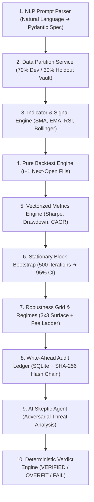

# Quantum FinTech AgentOS
> **Validation-First Quantitative Financial Research & Overfitting Audit Engine**

[](https://fastapi.tiangolo.com/)
[](https://nextjs.org/)
[](LICENSE)
[](#-architectural-workflow)

---

## 💡 Why Quantum FinTech AgentOS?

### The Crisis in Quantitative Strategy Backtesting
In quantitative finance, over **90% of backtested trading strategies fail when deployed in live markets**. 
Why? Because researchers continuously tweak parameters (e.g., testing 18-day, 19-day, 20-day moving averages) until they find a historical curve that looks impressive. This practice — known as **Data Snooping**, **P-Hacking**, or **Backtest Overfitting** — finds patterns in random market noise that collapse in real trading.

### Our Solution: The "Validation-First" Overfitting Audit Engine
**Quantum FinTech AgentOS** acts as an impartial scientific judge. Instead of just letting users generate strategies, it enforces strict statistical validation protocols to falsify flawed hypotheses before capital is risked:

1. 🔒 **30% Cryptographic Holdout Vault**: Locks away the final 24 months of data in an immutable vault that no optimization loop can peek at.
2. ⛓️ **Write-Ahead SHA-256 Audit Ledger**: Cryptographically hashes every single trial attempt into an append-only ledger, adjusting performance expectations via the Deflated Sharpe Ratio (DSR).
3. 🎲 **500-Iteration Stationary Block Bootstrap**: Performs Politis & Romano block resampling to calculate 95% confidence intervals and eliminate lucky backtest anomalies.
4. 🎯 **Empirical Null Calibration (<5% FDR)**: Benchmarks strategies against 1,000 synthetic null universes to maintain strict False Discovery Rate controls.

---

## 🏗️ Architectural Workflow (10-Node Pipeline)

Every natural language prompt submitted to Quantum FinTech AgentOS flows through a deterministic 10-node agentic workflow:



---

## 🖥️ Platform Suite: The 6 Navigation Screens

The web interface is built around a **modern, professional fintech design system** utilizing the Claude Warm Terracotta & Amber color palette (`#FAF6F0` Cream background, `#1E1915` Surface dark text, `#D97706` Amber accents, `#EA580C` Terracotta highlights).

| Screen | Route | Key Capabilities & Features |
|---|---|---|
| **Home Landing Page** | `/` | Executive product overview explaining overfitting audits, core stat guarantees, 6-screen navigation cards, and 10-node workflow diagram. |
| **Research Lab Canvas** | `/research` | Natural language strategy prompt input box, Pydantic spec confirmation modal, 10-node SSE workflow progress bar, real-time parameter sliders, and interactive Recharts equity curve comparison. |
| **Assets & Indicators** | `/assets` | Dev data split safety banner, historical OHLCV price series, technical indicator overlays (SMA, EMA, RSI, Bollinger), drawdown depth charts, and weekly cross-asset correlation matrix. |
| **Robustness & Regimes** | `/robustness` | 3x3 parameter neighborhood plateau heatmap, $0-20\text{ bps}$ commission fee sensitivity ladder, 2x2 market regimes matrix (Bull/Bear vs High/Low Vol), and single-use Holdout Reveal control button. |
| **Audit Center** | `/audit` | Un-editable SHA-256 write-ahead trial ledger stats, Deflated Sharpe Ratio (DSR), Probability of Backtest Overfitting (PBO), AI Skeptic Agent critique, and downloadable Fed SR 11-7 model report. |
| **Calibration & Placebo** | `/calibration` | 1,000 empirical null universe benchmark percentiles (`calibration.json`), false discovery rate controls, and live judge-seed placebo generator. |

---

## 📁 Repository Structure

```text
FinTech Agent OS/
├── README.md                        # Master Project Documentation & Specification
├── .gitignore                       # Repository exclusion rules (node_modules, .venv, .next)
│
├── backend/                         # FastAPI Python Analytics & Audit Engine
│   ├── pyproject.toml               # Python dependencies (uv package manager)
│   └── app/
│       ├── main.py                  # FastAPI server entrypoint
│       ├── api/
│       │   └── quant_router.py      # REST API endpoints (/parse, /run, /reveal, /assets, /calibration)
│       ├── analytics/
│       │   ├── engine.py            # Vectorized backtester & technical indicators (SMA, EMA, RSI)
│       │   ├── metrics.py           # Metrics calculation & 500-iteration Block Bootstrap CIs
│       │   ├── robustness.py        # 3x3 Parameter grid search, fee ladder & 2x2 market regimes
│       │   └── calibration.py       # 1,000 null universe generator & calibration.json loader
│       ├── audit/
│       │   ├── ledger.py            # SQLite write-ahead tamper-evident ledger (SHA-256 hash chain)
│       │   └── verdict.py           # 100% Deterministic 2-Phase Verdict Engine
│       ├── agents/
│       │   ├── skeptic.py           # AI Skeptic Agent adversarial critique generator
│       │   └── reporter.py          # Reporter Agent Fed SR 11-7 Model Card generator
│       ├── data/
│       │   └── asset_loader.py      # Multi-asset DataProvider & 70/30 Data Partition Service
│       └── models/
│           └── schemas.py           # Discriminated Pydantic v2 strategy parameter models
│
└── frontend/                        # Next.js 14 Modern Fintech Application
    ├── package.json
    ├── tailwind.config.js           # Warm Claude Terracotta & Amber design tokens
    └── src/
        ├── app/
        │   ├── page.tsx             # Product Home Landing Screen
        │   ├── research/page.tsx    # Research Lab Strategy Canvas
        │   ├── assets/page.tsx      # Assets & Indicators Studio
        │   ├── robustness/page.tsx  # Robustness & Market Regimes Chamber
        │   ├── audit/page.tsx       # Institutional Audit Center
        │   └── calibration/page.tsx # Calibration & Live Judge Placebo Demo
        ├── components/
        │   └── layout/
        │       └── Navbar.tsx       # Header navigation with status indicators
        └── lib/
            └── api.ts               # Typed API client & fallback state interface
```

---

## ⚡ Quick Start Guide

### Prerequisites
* **Python**: 3.11+
* **Node.js**: 18+

---

### 1. Start Backend API Server
Navigate to the `backend` directory and launch the Uvicorn server:
```bash
cd backend
uv run uvicorn app.main:app --reload --port 8001
```
* **API Documentation**: Access Swagger UI at `http://localhost:8001/docs`

---

### 2. Start Frontend Web Interface
In a separate terminal, navigate to the `frontend` directory and launch the Next.js development server:
```bash
cd frontend
npm run dev
```
* **Web Application**: Access the live web interface at `http://localhost:3000` (or `http://localhost:3001`)

---

## 🛡️ Statistical & Governance Rigor Guarantees

* **Politis & Romano Stationary Block Bootstrap**: Uses optimal block length $L=20$ over $B=500$ iterations to construct non-parametric 95% confidence intervals for Sharpe ratio and CAGR.
* **Deflated Sharpe Ratio (DSR)**: Formulated by Bailey & López de Prado (2014) to discount Sharpe ratios based on the variance of trial returns and total logged attempts ($N_{\text{eff}}$).
* **Federal Reserve SR 11-7 Compliance**: Generates automated markdown reports detailing model purpose, data lineage, assumptions, limitations, and stress-testing results.
