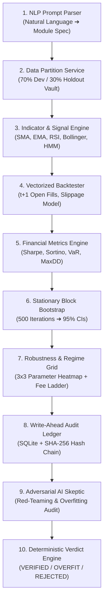
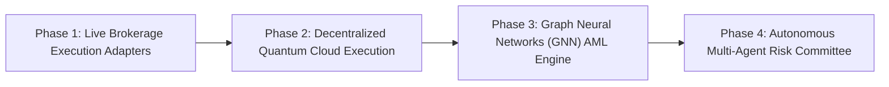

# 🌌 FinTech Agent OS: Quantitative Multi-Asset Financial Intelligence & Overfitting Audit Platform

> **Institutional-Grade AI-Driven Strategy Engineering, Autonomous Agent Swarm, Quantum Optimization & Cryptographic Verification Platform**

---

## 🌐 Live Production Deployments & Access Links

| Environment | Platform | URL | Status |
| :--- | :--- | :--- | :--- |
| **Web Application UI** | **Vercel** | [https://fintechos.vercel.app](https://fintechos.vercel.app) | `🟢 LIVE ONLINE` |
| **Backend REST & WS API** | **Render** | [https://fintechos.onrender.com](https://fintechos.onrender.com) | `🟢 LIVE ONLINE` |
| **Interactive API Manual** | **FastAPI Swagger** | [https://fintechos.onrender.com/docs](https://fintechos.onrender.com/docs) | `🟢 LIVE ONLINE` |

---

## 📜 Executive Summary & Product Vision

**FinTech Agent OS** is a state-of-the-art quantitative finance operating system engineered to bridge the gap between high-level natural language strategy formulation, rigorous mathematical backtesting, quantum portfolio optimization, and institutional-grade overfitting auditing.

### ⚠️ The Core Industry Problem: Backtest Overfitting & Selection Bias
In quantitative finance, over **90% of backtested strategies fail when deployed live**. Quantitative researchers often fall into the trap of **Data Snooping**, **P-Hacking**, and **Backtest Overfitting** — tuning moving average periods, RSI thresholds, and signal parameters until historical returns appear extraordinary. These "curve-fitted" strategies capture random market noise rather than true predictive alpha, leading to catastrophic capital losses in live execution.

### 🛡️ The FinTech Agent OS Solution: Validation-First Architecture
FinTech Agent OS functions as an **impartial scientific judge**. It eliminates self-deception and backtest overfitting through a **10-node agentic validation workflow**:

1. 🔒 **Atomic 30% Cryptographic Holdout Vault**: Locks the final 24 months of market data into an un-peekable vault.
2. ⛓️ **Write-Ahead SHA-256 Audit Ledger**: Cryptographically hashes every trial attempt into an append-only ledger, tracking total attempts ($N_{\text{eff}}$) to calculate the **Deflated Sharpe Ratio (DSR)**.
3. 🎲 **Stationary Block Bootstrap (500+ Iterations)**: Resamples historical returns using Politis & Romano block bootstrap to generate non-parametric 95% confidence intervals.
4. 🤖 **Adversarial AI Skeptic Agent**: Red-teams backtests against survivorship bias, regime sensitivity, and transaction cost decay.
5. ⚛️ **Quantum QUBO Portfolio Engine**: Formulates asset allocation as Quadratic Unconstrained Binary Optimization for classical simulated annealing and quantum annealers.

---

## 🏗️ 10-Node Agentic Pipeline Architecture



---

## 💻 Backend Architecture: Modules, Submodules & Formulas

The backend is built with **Python 3.11+** and **FastAPI**, engineered with modularity, mathematical precision, and high performance.

### 1. `app/analytics` — Quantitative Analytics Core

#### 📄 `metrics.py` — Financial & Risk Metric Engine
Calculates institutional performance and risk metrics from daily return series $R_t$:

* **Annualized Return ($\text{CAGR}$)**:
  $$\text{CAGR} = \left( \prod_{t=1}^{T} (1 + R_t) \right)^{\frac{252}{T}} - 1$$

* **Sharpe Ratio**:
  $$\text{Sharpe} = \frac{\mathbb{E}[R_p - R_f]}{\sigma_p} \times \sqrt{252}$$
  *where $R_f$ is risk-free rate, $\sigma_p$ is annualized standard deviation of excess returns.*

* **Sortino Ratio**:
  $$\text{Sortino} = \frac{\mathbb{E}[R_p - R_f]}{\sigma_d} \times \sqrt{252}$$
  *where $\sigma_d = \sqrt{\frac{1}{T} \sum_{t=1}^T \min(0, R_t - R_f)^2}$ is downside semi-deviation.*

* **Calmar Ratio**:
  $$\text{Calmar} = \frac{\text{CAGR}}{|\text{Maximum Drawdown}|}$$

* **Maximum Drawdown ($\text{MDD}$)**:
  $$\text{MDD} = \max_{t \in [1, T]} \left( \frac{\max_{s \le t} P_s - P_t}{\max_{s \le t} P_s} \right)$$

* **Value at Risk ($\text{VaR}_{\alpha}$ - 95% / 99% Historical & Parametric)**:
  $$\text{VaR}_{\alpha}(R) = - Q_{1-\alpha}(R) = - \inf \{ r \in \mathbb{R} : P(R \le r) \ge 1-\alpha \}$$

* **Conditional Value at Risk ($\text{CVaR}_{\alpha}$ / Expected Shortfall)**:
  $$\text{CVaR}_{\alpha}(R) = -\mathbb{E}[R \mid R \le -\text{VaR}_{\alpha}(R)]$$

---

#### 📄 `engine.py` — Vectorized & Event-Driven Backtest Simulator
* **Order Execution Protocol**: Signals generated at bar $t$ are filled at the opening price of bar $t+1$ to eliminate lookahead bias.
* **Slippage & Market Impact Model**:
  $$\text{Fill Price} = P_{t+1, \text{open}} \times \left(1 + \text{sign}(\text{side}) \cdot \left( \frac{\text{Slippage Bps}}{10000} + \gamma \sqrt{\frac{V_{\text{order}}}{V_{\text{daily}}}} \right) \right)$$
* **Transaction Fee Model**: Deducts fixed bps per trade execution ($\text{Commission Bps} / 10000$).

---

#### 📄 `robustness.py` — Overfitting Diagnostics & Bootstrap Engine
* **Stationary Block Bootstrap (Politis & Romano 1994)**: Resamples return series using pseudo-random block sizes drawn from a geometric distribution with mean block length $L=20$:
  $$P(L=k) = (1-p)^{k-1} p, \quad p = 1/20$$
* **Deflated Sharpe Ratio ($\text{DSR}$ - Bailey & López de Prado 2014)**: Adjusts observed Sharpe ratio $\hat{S}$ for trial variance $\sigma_S^2$ and total logged trials $N_{\text{eff}}$:
  $$\text{DSR} = Z \left( \frac{(\hat{S} - S_0) \sqrt{T-1}}{\sqrt{1 - \gamma_3 \hat{S} + \frac{\gamma_4 - 1}{4} \hat{S}^2}} \right)$$
  *where $\gamma_3$ is skewness, $\gamma_4$ is kurtosis, and $S_0 = \sqrt{\frac{\sigma_S^2}{2} \ln(N_{\text{eff}})}$.*

---

#### 📄 `calibration.py` — Null Universe & Walk-Forward Optimizer
* **1,000 Empirical Null Universes**: Generates synthetic phase-scrambled time series to benchmark strategies against random chance.
* **Walk-Forward Efficiency Ratio ($\text{WFER}$)**:
  $$\text{WFER} = \frac{\text{Sharpe}_{\text{Out-of-Sample}}}{\text{Sharpe}_{\text{In-Sample}}}$$

---

### 2. `app/analytics/strategy_modules` — Quant Strategy Module Library

Each quant module implements a standardized base protocol interface (`BaseStrategyModule` in `base.py`) registered in `registry.py`.

| Module File | Class Name | Category | Mathematical Logic / Formula |
|---|---|---|---|
| [sma_crossover.py](file:///d:/Data%20Science/SIH/FinTech%20Agent%20OS/backend/app/analytics/strategy_modules/sma_crossover.py) | `SMACrossoverModule` | Trend | Long when $\text{SMA}_{\text{short}}(t) > \text{SMA}_{\text{long}}(t)$, Short/Cash otherwise. |
| [bollinger_bands.py](file:///d:/Data%20Science/SIH/FinTech%20Agent%20OS/backend/app/analytics/strategy_modules/bollinger_bands.py) | `BollingerBandsModule` | Mean Reversion | Bands: $\mu_N \pm k \cdot \sigma_N$. Buy when $P_t < \text{Lower}$, Sell when $P_t > \text{Upper}$. |
| [rsi_oscillator.py](file:///d:/Data%20Science/SIH/FinTech%20Agent%20OS/backend/app/analytics/strategy_modules/rsi_oscillator.py) | `RSIOscillatorModule` | Momentum | $\text{RSI} = 100 - \frac{100}{1 + \frac{\text{EMA}(\text{Gain}, n)}{\text{EMA}(\text{Loss}, n)}}$. Oversold $< 30$, Overbought $> 70$. |
| [macd_momentum.py](file:///d:/Data%20Science/SIH/FinTech%20Agent%20OS/backend/app/analytics/strategy_modules/macd_momentum.py) | `MACDMomentumModule` | Momentum | $\text{MACD} = \text{EMA}_{12} - \text{EMA}_{26}$, $\text{Signal} = \text{EMA}_9(\text{MACD})$. Long on bullish crossover. |
| [zscore_mean_reversion.py](file:///d:/Data%20Science/SIH/FinTech%20Agent%20OS/backend/app/analytics/strategy_modules/zscore_mean_reversion.py) | `ZScoreMeanReversionModule` | Stat Arb | $Z_t = \frac{P_t - \mu_w}{\sigma_w}$. Long when $Z_t < -2.0$, Short when $Z_t > +2.0$. |
| [atr_sizing.py](file:///d:/Data%20Science/SIH/FinTech%20Agent%20OS/backend/app/analytics/strategy_modules/atr_sizing.py) | `ATRSizingModule` | Volatility Sizing | $\text{Position Size} = \frac{\text{Capital} \times \text{Risk \%}}{k \cdot \text{ATR}_n(t)}$. |
| [ichimoku.py](file:///d:/Data%20Science/SIH/FinTech%20Agent%20OS/backend/app/analytics/strategy_modules/ichimoku.py) | `IchimokuCloudModule` | Trend | Tenkan ($\frac{H_{9}+L_{9}}{2}$), Kijun ($\frac{H_{26}+L_{26}}{2}$), Senkou Span A/B Kumo cloud boundaries. |
| [supertrend.py](file:///d:/Data%20Science/SIH/FinTech%20Agent%20OS/backend/app/analytics/strategy_modules/supertrend.py) | `SupertrendModule` | Trend Following | $\text{Upper/Lower} = \frac{H+L}{2} \pm \text{Multiplier} \times \text{ATR}_n$. Trailing stop trend lock. |
| [vwap_execution.py](file:///d:/Data%20Science/SIH/FinTech%20Agent%20OS/backend/app/analytics/strategy_modules/vwap_execution.py) | `VWAPExecutionModule` | Execution | $\text{VWAP}_t = \frac{\sum P_i V_i}{\sum V_i}$. Benchmark execution & intra-day mean reversion. |
| [pairs_trading.py](file:///d:/Data%20Science/SIH/FinTech%20Agent%20OS/backend/app/analytics/strategy_modules/pairs_trading.py) | `PairsTradingModule` | Cointegration | Spread $S_t = P_A - \beta P_B$. OLS cointegration $\beta$ estimation & band trading. |
| [momentum_rotation.py](file:///d:/Data%20Science/SIH/FinTech%20Agent%20OS/backend/app/analytics/strategy_modules/momentum_rotation.py) | `MomentumRotationModule` | Cross-Asset | Ranks universe assets by $N$-month momentum score and allocates capital to top $K$. |
| [ml_regime.py](file:///d:/Data%20Science/SIH/FinTech%20Agent%20OS/backend/app/analytics/strategy_modules/ml_regime.py) | `MLRegimeModule` | Machine Learning | Gaussian Hidden Markov Model (HMM) 3-state classifier (Bull, Bear, Sideways/High-Vol). |
| [var_cvar.py](file:///d:/Data%20Science/SIH/FinTech%20Agent%20OS/backend/app/analytics/strategy_modules/var_cvar.py) | `VaRCVaRModule` | Tail Risk | Historical & Cornish-Fisher VaR/CVaR risk engine for dynamic position deleveraging. |
| [monte_carlo.py](file:///d:/Data%20Science/SIH/FinTech%20Agent%20OS/backend/app/analytics/strategy_modules/monte_carlo.py) | `MonteCarloModule` | Stochastic Sim | Geometric Brownian Motion $dS_t = \mu S_t dt + \sigma S_t dW_t$ 1,000-path simulation. |
| [portfolio_optimization.py](file:///d:/Data%20Science/SIH/FinTech%20Agent%20OS/backend/app/analytics/strategy_modules/portfolio_optimization.py) | `PortfolioOptimizationModule` | Asset Allocation | Markowitz Mean-Variance ($\min w^T \Sigma w$), Hierarchical Risk Parity (HRP), Min-Var. |

---

### 3. `app/agents` — Multi-Agent Intelligence Swarm

* 📄 [strategy_agent.py](file:///d:/Data%20Science/SIH/FinTech%20Agent%20OS/backend/app/agents/strategy_agent.py): Natural language prompt parser and strategy dynamic graph synthesizer. Translates user prompts like *"Build an ATR position-sized Bollinger Band strategy on Gold"* into fully wired multi-module JSON DAG pipelines.
* 📄 [skeptic.py](file:///d:/Data%20Science/SIH/FinTech%20Agent%20OS/backend/app/agents/skeptic.py): Adversarial Red-Team Agent. Analyzes backtest results for signs of curve-fitting, lookahead leakage, unrealistic liquidity assumptions, and regime fragility.
* 📄 [reporter.py](file:///d:/Data%20Science/SIH/FinTech%20Agent%20OS/backend/app/agents/reporter.py): Institutional Reporter Agent. Generates compliant Federal Reserve SR 11-7 Model Risk Governance Documentation tear-sheets.
* 📄 [factory.py](file:///d:/Data%20Science/SIH/FinTech%20Agent%20OS/backend/app/agents/factory.py): Multi-agent orchestrator that manages parallel execution loops and state transitions.

---

### 4. `app/audit` — Immutable Audit Ledger & Verification Engine

* 📄 [strategy_store.py](file:///d:/Data%20Science/SIH/FinTech%20Agent%20OS/backend/app/audit/strategy_store.py): SQLite persistence database (`strategy_history.db`) maintaining all historical run outputs, prompts, pipelines, metrics, and AI reasoning.
* 📄 [verdict.py](file:///d:/Data%20Science/SIH/FinTech%20Agent%20OS/backend/app/audit/verdict.py): **Deterministic 2-Phase Verification Engine**:
  * **Phase A**: Minimum Detectable Effect (MDE) Statistical Power analysis ($>50\%$), selection-aware p-value check ($p < 0.10$).
  * **Phase B**: Atomic Holdout evaluation. Checks whether out-of-sample Sharpe ratio degrades by more than 35% relative to in-sample performance.
* 📄 [ledger.py](file:///d:/Data%20Science/SIH/FinTech%20Agent%20OS/backend/app/audit/ledger.py): Cryptographic SHA-256 Hash Chain ledger ensuring tamper-proof audit trails for compliance.

---

### 5. `app/quantum` — Quantum QUBO Portfolio Optimization

* 📄 [qubo_formulator.py](file:///d:/Data%20Science/SIH/FinTech%20Agent%20OS/backend/app/quantum/qubo_formulator.py): Converts continuous Markowitz portfolio selection into a **Quadratic Unconstrained Binary Optimization (QUBO)** Hamiltonian for Quantum Annealers (e.g. D-Wave) and Classical Simulated Annealing:
  $$H(x) = - \sum_{i=1}^N \mu_i x_i + \gamma \sum_{i=1}^N \sum_{j=1}^N \sigma_{ij} x_i x_j + \lambda \left( \sum_{i=1}^N x_i - K \right)^2$$
  *where $x_i \in \{0, 1\}$ indicates inclusion of asset $i$, $\gamma$ is risk aversion factor, and $\lambda$ penalizes deviation from cardinality constraint $K$.*

---

### 6. `app/data` — Multi-Asset Data Pipelines

* 📄 [asset_loader.py](file:///d:/Data%20Science/SIH/FinTech%20Agent%20OS/backend/app/data/asset_loader.py): Fetches real-time market OHLCV data from Yahoo Finance (`yfinance`) across Crypto (`BTC-USD`, `ETH-USD`), Commodities (`GC=F` Gold, `CL=F` Crude Oil), Equities (`NVDA`, `AAPL`, `SPY`), and Forex (`EURUSD=X`), with fallback synthetic GBM data generators.
* 📄 [elliptic_loader.py](file:///d:/Data%20Science/SIH/FinTech%20Agent%20OS/backend/app/data/elliptic_loader.py) & 📄 [amlsim_loader.py](file:///d:/Data%20Science/SIH/FinTech%20Agent%20OS/backend/app/data/amlsim_loader.py): Loaders for Bitcoin graph ML transaction datasets (Elliptic & AMLSim) for anti-money laundering and illicit transaction graph analysis.

---

## 🎨 Frontend Architecture: Pages, Visualizations & Graphs

The web application is built with **Next.js 14**, **React 18**, **TypeScript**, and **Vanilla CSS / Custom Design System** styled in dark mode and warm gold/terracotta accents.

### 🖥️ Screen 1: AI Strategy Builder & Execution Dashboard (`/` - [page.tsx](file:///d:/Data%20Science/SIH/FinTech%20Agent%20OS/frontend/src/app/page.tsx))
* **Natural Language Prompt Console**: Real-time prompt input with instant AI synthesis.
* **Wired Pipeline Drawer**: Visual representation of active strategy modules (e.g., Bollinger + ATR + HMM).
* **Interactive Backtest Recharts Canvas**:
  * **Equity Curve Chart**: Plots Portfolio Cumulative Equity vs Benchmark Asset.
  * **Drawdown Depth Plot**: Visualizes percentage underwater periods over time.
* **Performance Summary Metric Grid**: Displays Total Return, Sharpe Ratio, Sortino Ratio, Max Drawdown, Win Rate, and Total Trades.
* **Strategy Store History Drawer**: Displays past persisted strategy runs with instant reload capabilities.

---

### 🏛️ Screen 2: Markets Hub & Bloomberg Terminal (`/markets` & `/assets` - [page.tsx](file:///d:/Data%20Science/SIH/FinTech%20Agent%20OS/frontend/src/app/markets/page.tsx))
* **`BloombergTickerRibbon.tsx`**: Scrolling live multi-asset ticker bar with price changes and volatility badges.
* **`BloombergChart.tsx`**: Institutional candlestick and line price chart featuring volume overlays, moving averages, and RSI indicator panels.
* **`MarketsAtAGlance.tsx` & `MarketsBoard.tsx`**: High-density market overview table categorizing Crypto, Commodities, Indices, and Equities.
* **`MarketsMegaMenu.tsx`**: Navigation menu for asset universe selection.

---

### 🔬 Screen 3: Strategy Lab Canvas (`/research` - [page.tsx](file:///d:/Data%20Science/SIH/FinTech%20Agent%20OS/frontend/src/app/research/page.tsx))
* **Drag-and-Drop Module DAG Canvas**: Multi-module pipeline composer connecting signal generators, risk sizing, and ML regime filters.
* **Parameter Tuning Drawer**: Real-time sliders for lookback windows, std dev multipliers, and risk fractions.

---

### 📊 Screen 4: Robustness & Market Regimes (`/robustness` - [page.tsx](file:///d:/Data%20Science/SIH/FinTech%20Agent%20OS/frontend/src/app/robustness/page.tsx))
* **3x3 Parameter Sensitivity Heatmap**: Grid mapping Sharpe ratio stability across neighboring lookback parameters.
* **Transaction Fee Ladder**: Bar chart showing strategy decay under 0 to 20 bps slippage and commission costs.
* **2x2 Market Regime Matrix**: Evaluates performance breakdown across Bull vs Bear and High Vol vs Low Vol market states.
* **Atomic Holdout Reveal Vault**: Controlled one-time reveal button to validate out-of-sample data.

---

### 🛡️ Screen 5: Audit & Compliance Suite (`/audit` - [page.tsx](file:///d:/Data%20Science/SIH/FinTech%20Agent%20OS/frontend/src/app/audit/page.tsx))
* **SHA-256 Cryptographic Ledger Timeline**: Displays immutable hash chain sequence for all backtest attempts.
* **AI Skeptic Critique Panel**: Red-teaming analysis highlighting over-fitting risks and structural flaws.
* **Deterministic Verdict Status**: Displays `VERIFIED`, `OVERFIT`, or `REJECTED` verdict badge based on statistical power and holdout integrity.

---

### 🎲 Screen 6: Calibration & Null Universe Lab (`/calibration` - [page.tsx](file:///d:/Data%20Science/SIH/FinTech%20Agent%20OS/frontend/src/app/calibration/page.tsx))
* **Empirical Null Distribution Chart**: Plots strategy Sharpe ratio against 1,000 synthetic null universes.
* **False Discovery Rate (FDR) Controller**: Interactive p-value threshold calibration tool.

---

## 📐 Complete Mathematical Reference Guide

| Metric / Model | Mathematical Formulation | Description |
|---|---|---|
| **Sharpe Ratio** | $S = \frac{\mathbb{E}[R_p - R_f]}{\sigma_p} \sqrt{252}$ | Risk-adjusted return relative to total volatility. |
| **Sortino Ratio** | $S_d = \frac{\mathbb{E}[R_p - R_f]}{\sqrt{\frac{1}{T} \sum \min(0, R_t - R_f)^2}} \sqrt{252}$ | Risk-adjusted return relative to downside volatility. |
| **Calmar Ratio** | $C = \frac{\text{CAGR}}{\max_{t} \text{Drawdown}(t)}$ | Ratio of annualized return to maximum historical drawdown. |
| **Deflated Sharpe Ratio (DSR)** | $\text{DSR} = Z\left(\frac{(\hat{S} - S_0)\sqrt{T-1}}{\sqrt{1 - \gamma_3 \hat{S} + \frac{\gamma_4-1}{4}\hat{S}^2}}\right)$ | Sharpe ratio discounted for selection bias and trial variance. |
| **Historical VaR (95%)** | $\text{VaR}_{0.95} = -\text{Percentile}(R, 5\%)$ | Maximum expected loss at 95% confidence level. |
| **Expected Shortfall (CVaR)** | $\text{CVaR}_{\alpha} = -\mathbb{E}[R \mid R \le -\text{VaR}_{\alpha}]$ | Expected loss given that loss exceeds the VaR threshold. |
| **HMM Market Regime** | $P(S_t = j \mid S_{t-1} = i) = A_{ij}, \quad y_t \sim \mathcal{N}(\mu_j, \Sigma_j)$ | Gaussian Hidden Markov Model for hidden market state inference. |
| **QUBO Portfolio Hamiltonian** | $H(x) = -\mu^T x + \gamma x^T \Sigma x + \lambda (\mathbf{1}^T x - K)^2$ | Binary optimization for asset selection under risk & cardinality limits. |
| **Stationary Block Bootstrap** | $P(L=k) = (1-p)^{k-1} p, \quad p = 1/\bar{L}$ | Resampling returns with random block sizes to retain temporal dependence. |

---

## 🔮 Vision for Further Development: Future Roadmap

Based on our architectural vision, the next development phases will focus on expanding execution capabilities, quantum integration, and deep learning for anti-fraud:



### 🚀 Phase 1: Live Brokerage & Order Routing Adapters
* **Alpaca & Interactive Brokers (IBKR) FIX Protocol Integration**: Transition from simulated backtesting to direct paper/live trading via REST & WebSocket order routing.
* **Real-time Order Book Dynamics**: Incorporate L2/L3 order book market depth, bid-ask spread impact, and order flow imbalance signals.

### ⚛️ Phase 2: Native Quantum Hardware Cloud Integration
* **D-Wave Leap & IBM Qiskit Connectors**: Connect `qubo_formulator.py` to real D-Wave Advantage quantum annealers and IBM Quantum QPUs via cloud APIs.
* **Quantum Approximate Optimization Algorithm (QAOA)**: Implement QAOA circuits for constrained multi-period portfolio rebalancing.

### 🕸️ Phase 3: Graph Neural Network (GNN) Anti-Money Laundering Engine
* **Temporal Graph Convolutional Networks (T-GCN)**: Utilize `elliptic_loader.py` and `amlsim_loader.py` to train PyTorch Geometric GNN models for real-time Bitcoin transaction illicit node classification.
* **Sub-graph Anomaly Alerts**: Flag high-risk wallet clusters and mixer transactions directly on the Markets dashboard.

### 🤖 Phase 4: Autonomous Multi-Agent Risk Committee
* **Continuous Portfolio Monitoring**: Deploy a background worker swarm (`RiskCommittee`) that continuously evaluates live market volatility, HMM regime switches, and VaR limit breaches.
* **Automated Circuit Breakers**: Trigger automated position de-leveraging and hedge execution when tail risk metrics exceed pre-set risk limits.

---

## ⚡ Quick Start & Development Setup

### 1. Prerequisites
* **Python**: `3.11` or higher (`uv` package manager recommended)
* **Node.js**: `18.x` or higher (`npm` / `pnpm`)

### 2. Launch Backend API Server
```bash
cd backend
uv run uvicorn app.main:app --reload --port 8000
```
* **API Documentation**: Access Swagger UI at `http://localhost:8000/docs`

### 3. Launch Frontend Web Application
```bash
cd frontend
npm run dev
```
* **Web Application**: Access live interface at `http://localhost:3000`

---

*FinTech Agent OS — Engineered with scientific rigor, mathematical precision, and state-of-the-art AI.*
